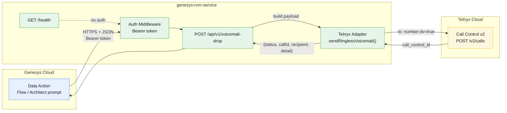
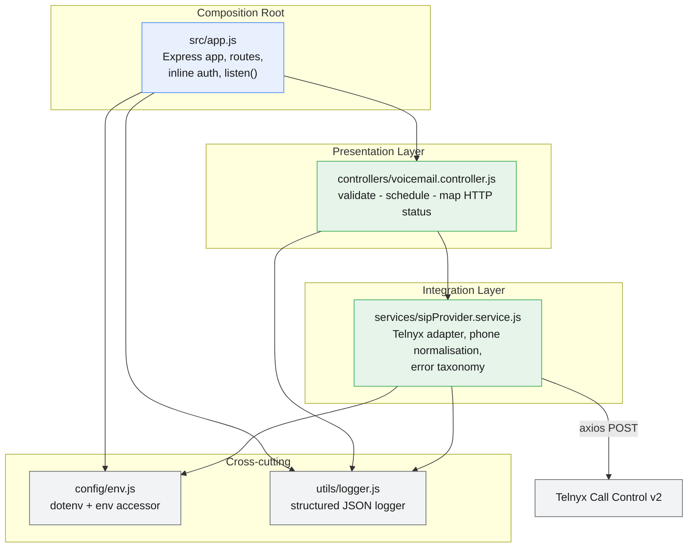
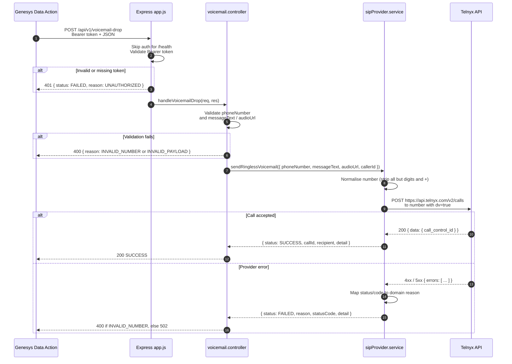
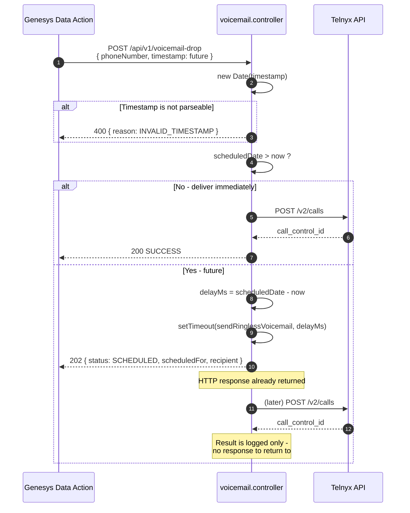
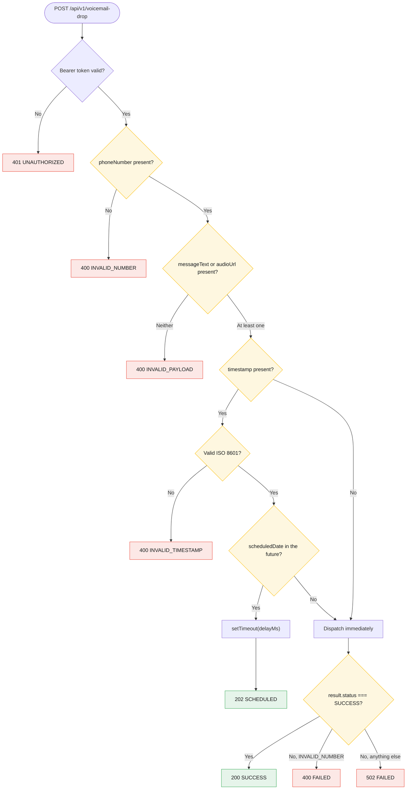
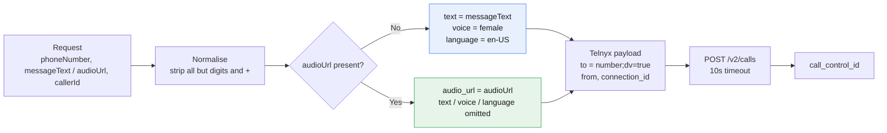
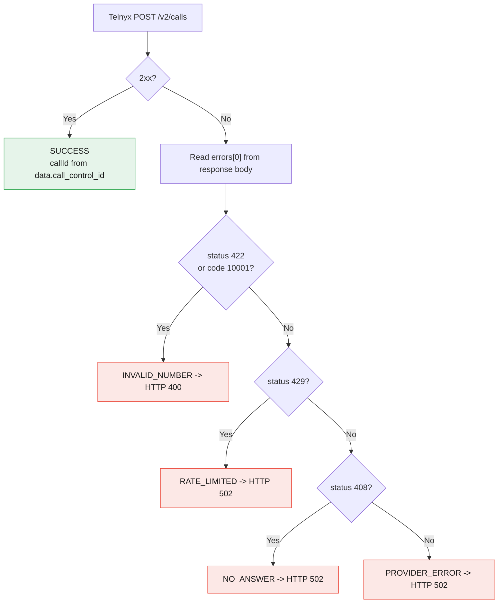
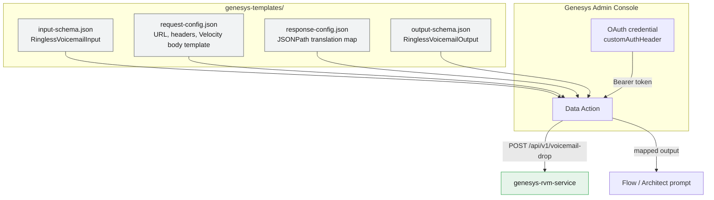

# genesys-rvm-service

**Ringless Voicemail Drop Microservice for Genesys Cloud Data Actions**

A small, stateless Node.js/Express service that drops a voicemail directly into a
recipient's voicemail box **without ringing their phone**. It is designed to be called
from a [Genesys Cloud](https://www.genesys.com/) **Data Action**, and it fulfils the drop
through the **Telnyx Call Control v2** API using the direct-to-voicemail routing flag
(`;dv=true`).

The message can be delivered two ways:

| Mode | Field | Behaviour |
| --- | --- | --- |
| Text-to-Speech | `messageText` | Telnyx synthesises speech (`voice: female`, `language: en-US`) |
| Pre-recorded | `audioUrl` | Telnyx streams the supplied audio file |

---

## Table of Contents

- [Architecture](#architecture)
- [Tech Stack](#tech-stack)
- [Project Structure](#project-structure)
- [Getting Started](#getting-started)
- [Configuration](#configuration)
- [API Reference](#api-reference)
- [Request Flow](#request-flow)
- [Error Handling](#error-handling)
- [Genesys Cloud Integration](#genesys-cloud-integration)
- [Docker](#docker)
- [Logging](#logging)
- [Testing](#testing)
- [Limitations & Roadmap](#limitations--roadmap)

---

## Architecture

The service is a thin HTTP gateway (BFF) in front of a telecom provider. It owns a stable
JSON response envelope so that Genesys never has to understand Telnyx-specific error shapes.



### Internal layering

A strict, one-way dependency flow. Controllers never read `process.env`; services never
touch `req`/`res`.



### Design patterns

- **Adapter / Anti-Corruption Layer** — `sipProvider.service.js` isolates the single
  external vendor. Swapping Telnyx for Twilio or Vonage touches only this file.
- **Result-object error handling** — the service returns
  `{ status: 'FAILED', reason, ... }` instead of throwing. The controller is the only
  place that decides HTTP status codes.
- **Contract-first integration** — `genesys-templates/*.json` are the machine-readable
  API contract with the Genesys platform.
- **Stateless** — no database, no cache, no queue.

---

## Tech Stack

| | |
| --- | --- |
| Runtime | Node.js `>= 20.0.0` |
| Language | JavaScript (CommonJS) |
| Framework | Express `^4.19.0` |
| HTTP client | Axios `^1.7.0` |
| Config | dotenv `^16.4.0` |
| Telephony | Telnyx Call Control v2 REST API |
| Container | `node:20-alpine` |
| Storage | **None** — the service holds no state |

There are no dev dependencies, no linter, and no test framework configured.

---

## Project Structure

```text
genesys-rvm-service/
├── src/
│   ├── app.js                          # Entry point: Express setup, routes, auth, listen
│   ├── config/
│   │   └── env.js                      # dotenv + single env-var accessor
│   ├── controllers/
│   │   └── voicemail.controller.js     # Validation, scheduling, HTTP status mapping
│   ├── services/
│   │   └── sipProvider.service.js      # Telnyx Call Control adapter
│   └── utils/
│       └── logger.js                   # Structured JSON logger
├── genesys-templates/                  # Genesys Data Action contract (schema-as-code)
│   ├── input-schema.json               # Data Action input schema (JSON Schema draft-04)
│   ├── output-schema.json              # Data Action output schema
│   ├── request-config.json             # Request URL / headers / body template
│   └── response-config.json            # Response translation map
├── .env.example                        # Environment variable template
├── Dockerfile                          # Production container image
├── package.json
└── README.md
```

---

## Getting Started

### Prerequisites

- Node.js 20 or later
- A Telnyx account with **Call Control v2** enabled
- A Telnyx **Call Control application / connection ID**
- A Telnyx-provisioned calling number in E.164 format

### Install & run

```bash
# 1. Install dependencies
npm install          # or: npm ci

# 2. Create your environment file
cp .env.example .env # Linux/macOS
copy .env.example .env   # Windows

# 3. Fill in the real values in .env (see Configuration below)

# 4. Start
npm start            # node src/app.js
npm run dev          # node --watch src/app.js  (auto-restart on change)
```

On success you will see:

```json
{"level":"INFO","timestamp":"2026-01-01T00:00:00.000Z","message":"Ringless Voicemail service operational on port 3000"}
```

### Quick check

```bash
curl http://localhost:3000/health
# OK
```

---

## Configuration

All environment variables are read once in `src/config/env.js`.

| Variable | Required | Default | Description | Secret |
| --- | :---: | --- | --- | :---: |
| `PORT` | No | `3000` | TCP port for the HTTP listener | No |
| `TELNYX_API_KEY` | **Yes** | — | Telnyx API key, sent as `Authorization: Bearer` | **Yes** |
| `TELNYX_CONNECTION_ID` | **Yes** | — | Telnyx Call Control application ID (UUID) | No |
| `DEFAULT_FROM_NUMBER` | **Yes** | — | Caller ID used when the request omits `callerId` | No |
| `AUTH_TOKEN` | **Yes** | — | Shared secret callers must present as a Bearer token | **Yes** |
| `NODE_ENV` | No | — | Set to `production` by the Dockerfile | No |

> ⚠️ **`AUTH_TOKEN` is effectively mandatory.** The auth middleware is gated on
> `config.authToken && ...`, so if the variable is **unset the service fails open** and
> every endpoint becomes publicly accessible. Always set it in any deployed environment.
>
> ⚠️ There is **no startup validation** of these variables. If `TELNYX_API_KEY` is
> missing, the service boots normally and only fails at call time, surfacing as
> `502 PROVIDER_ERROR`.

`.env` is gitignored. See [Limitations](#limitations--roadmap) for the related Docker
caveat about `COPY . .`.

---

## API Reference

Base URL: `http://<host>:<port>`

### `GET /health`

Liveness probe. **Bypasses authentication.**

| | |
| --- | --- |
| Auth | None |
| Response | `200` · `text/plain` · `OK` |

---

### `POST /api/v1/voicemail-drop`

| | |
| --- | --- |
| Auth | `Authorization: Bearer <AUTH_TOKEN>` |
| Content-Type | `application/json` |
| Success | `200` (immediate) · `202` (scheduled) |
| Failure | `400` · `401` · `502` |

#### Request body

| Field | Type | Required | Description |
| --- | --- | :---: | --- |
| `phoneNumber` | string | **Yes** | Recipient number. Punctuation and spaces are stripped before dispatch. |
| `messageText` | string | Conditional | Text to synthesise. Required unless `audioUrl` is set. |
| `audioUrl` | string | Conditional | URL of a prerecorded audio file. Takes precedence over `messageText`. |
| `timestamp` | string | No | ISO 8601. A **future** value schedules the drop and returns `202`. |
| `callerId` | string | No | Overrides `DEFAULT_FROM_NUMBER` for this call only. |

#### Request examples

**Immediate text-to-speech drop**

```bash
curl -X POST http://localhost:3000/api/v1/voicemail-drop \
  -H "Content-Type: application/json" \
  -H "Authorization: Bearer $AUTH_TOKEN" \
  -d '{
        "phoneNumber": "+15551234567",
        "messageText": "Your delivery is scheduled for tomorrow between 2 and 4 PM."
      }'
```

```json
{
  "status": "SUCCESS",
  "callId": "v3:abc123def456",
  "recipient": "+15551234567",
  "detail": "Voicemail drop initiated successfully"
}
```

**Prerecorded audio, scheduled 1 minute out**

```bash
curl -X POST http://localhost:3000/api/v1/voicemail-drop \
  -H "Content-Type: application/json" \
  -H "Authorization: Bearer $AUTH_TOKEN" \
  -d '{
        "phoneNumber": "+15551234567",
        "audioUrl": "https://example.com/message.mp3",
        "timestamp": "2026-01-01T12:01:00.000Z",
        "callerId": "+18005550199"
      }'
```

```json
{
  "status": "SCHEDULED",
  "scheduledFor": "2026-01-01T12:01:00.000Z",
  "recipient": "+15551234567",
  "detail": "Voicemail drop queued for future delivery"
}
```

**Failure**

```json
{
  "status": "FAILED",
  "reason": "RATE_LIMITED",
  "statusCode": 429,
  "detail": "..."
}
```

#### Responses

| Code | `status` | When |
| --- | --- | --- |
| `200` | `SUCCESS` | Telnyx accepted the call |
| `202` | `SCHEDULED` | `timestamp` was in the future |
| `400` | `FAILED` | Validation error, or upstream `INVALID_NUMBER` |
| `401` | `FAILED` | Missing or invalid Bearer token |
| `502` | `FAILED` | Any other upstream/provider failure |

---

## Request Flow

### Immediate delivery



### Scheduled delivery

Note that the `202` is returned **before** the drop is executed — delivery happens later
from an in-process timer.



### Validation decision tree



### How the drop actually works

The `;dv=true` suffix on the `to` field is Telnyx's **direct-to-voicemail** URI routing
parameter. It is the single flag that makes the call ringless — the handset never rings
and the call is diverted straight into the voicemail box.



`text`, `voice` and `language` are set to `undefined` when `audioUrl` is supplied, so
`JSON.stringify` (performed by Axios) omits those keys entirely — the two modes are
mutually exclusive on the wire.

---

## Error Handling

### Provider error mapping

`sendRinglessVoicemail()` never throws. It normalises Telnyx failures into a fixed set of
domain `reason` values:

| Upstream condition | `reason` | HTTP status |
| --- | --- | --- |
| Telnyx `422`, or error code `10001` | `INVALID_NUMBER` | `400` |
| Telnyx `429` | `RATE_LIMITED` | `502` |
| Telnyx `408` | `NO_ANSWER` | `502` |
| Anything else (incl. network / timeout) | `PROVIDER_ERROR` | `502` |



> The upstream `statusCode` is preserved in the response body but the **HTTP status is
> always remapped** to `400` or `502` — the Telnyx status is never propagated directly.

### Response envelope

Every response uses a consistent envelope. This is the contract the Genesys
`response-config.json` translation map depends on:

```text
{ status, reason, statusCode, detail }   # failure
{ status, callId, recipient, detail }    # immediate success
{ status, scheduledFor, recipient, detail }  # scheduled
```

---

## Genesys Cloud Integration

The `genesys-templates/` directory contains the Data Action contract as code. Nothing in
this directory is read by the running service — it is imported into the Genesys Admin UI.



### Setup steps

1. **Deploy the service** to a publicly reachable HTTPS host and note the public URL.
2. **Create a credential.** In *Admin → Integrations → Data Actions*, add a custom auth
   credential whose `customAuthHeader` value is the service's `AUTH_TOKEN` (URL-encoded).
3. **Import `input-schema.json`** as the Data Action input schema.
4. **Import `request-config.json`** and **replace the placeholder URL**
   `https://your-service-domain.com/api/v1/voicemail-drop` with your real deployed URL.
   This is the one manual edit required.
5. **Import `response-config.json`** to map the service response to Data Action output.
6. **Import `output-schema.json`** as the output schema.
7. **Reference the Data Action** from a flow, journey, or Architect prompt.

### How the templates work

- `request-config.json` uses a **Velocity** template that conditionally includes
  `messageText`, `audioUrl`, `timestamp` and `callerId` only when they are non-empty,
  matching the service's "at least one of `messageText`/`audioUrl`" rule.
- `response-config.json` declares `translationMapDefaults` of `"N/A"` for `callId` and
  `scheduledFor`, because the two success variants are mutually exclusive: an immediate
  success has no `scheduledFor`, and a `202` has no `callId`.

---

## Docker

```bash
docker build -t genesys-rvm-service .
docker run -p 3000:3000 --env-file .env genesys-rvm-service
```

The image is based on `node:20-alpine`, installs production dependencies in a cached
layer, runs as the non-root `node` user, and starts with `CMD ["node", "src/app.js"]`.

> ⚠️ There is no `.dockerignore` in the repo, so `COPY . .` will copy your local
> `node_modules/`, `.git/`, and — if present — your **`.env` with live secrets** into the
> image. Add a `.dockerignore` before building in CI.
>
> ⚠️ `npm ci --only=production` is deprecated in npm 7+; `--omit=dev` is preferred.

---

## Logging

`src/utils/logger.js` emits single-line JSON to stdout/stderr — ready for CloudWatch,
Datadog, or ELK without a logging library. Two levels only: `INFO` and `ERROR`.

```json
{"level":"INFO","timestamp":"2026-01-01T12:00:00.000Z","message":"Voicemail drop dispatched successfully","callId":"v3:abc123","recipient":"+15551234567"}
{"level":"ERROR","timestamp":"2026-01-01T12:00:00.000Z","message":"Provider error during voicemail drop","reason":"RATE_LIMITED","statusCode":429,"detail":"..."}
```

Credentials are never logged. Recipient phone numbers and call IDs **are** logged — treat
your log sink as PII-bearing.

---

## Testing

There is **no automated test suite** in this repository (no test runner, no
`devDependencies`, no `test` script). Verification is currently manual via `curl`:

```bash
# Liveness
curl http://localhost:3000/health

# Immediate TTS drop
curl -X POST http://localhost:3000/api/v1/voicemail-drop \
  -H "Content-Type: application/json" \
  -H "Authorization: Bearer $AUTH_TOKEN" \
  -d '{"phoneNumber":"+15551234567","messageText":"Your delivery is scheduled."}'

# Validation failure - no message body
curl -X POST http://localhost:3000/voicemail-drop \
  -H "Content-Type: application/json" \
  -H "Authorization: Bearer $AUTH_TOKEN" \
  -d '{"phoneNumber":"+15551234567"}'
# => 400 { "reason": "INVALID_PAYLOAD" }
```

`sendRinglessVoicemail()` in `services/sipProvider.service.js` and the validation logic in
`handleVoicemailDrop()` are the natural unit-test seams. Note that `app.js` calls
`app.listen()` at module load and does not export the app, so it cannot be mounted in a
test harness without a small refactor.

---

## Limitations & Roadmap

Known issues, roughly ordered by operational impact:

| # | Issue | Impact |
| --- | --- | --- |
| 1 | **Auth fails open** when `AUTH_TOKEN` is unset (`app.js:14`) | Unauthenticated public access to the drop endpoint |
| 2 | **Scheduling is non-durable** — bare in-process `setTimeout` (`voicemail.controller.js:42`) | Jobs are lost on restart/redeploy, duplicated across replicas, and capped at Node's ~24.8-day timer limit (anything longer fires immediately) |
| 3 | **No error-handling middleware** and no `try/catch` in the controller | An unexpected throw returns a non-JSON HTML 500, breaking the response contract |
| 4 | **Unhandled async in the timer callback** — no `.catch()` on the `async` `setTimeout` callback | A throw becomes an unhandled rejection |
| 5 | **No startup config validation** | Missing Telnyx credentials boot cleanly and fail only at call time |
| 6 | **No `.dockerignore`** | Local `.env` and `node_modules/` get baked into the image |
| 7 | **Deprecated `npm ci --only=production`** in the Dockerfile | Works, but `--omit=dev` is the modern flag |
| 8 | **Hardcoded Telnyx URL**, TTS `voice: 'female'`, `language: 'en-US'` | Not configurable per request or environment |
| 9 | **`recipient` inconsistency** — raw in the `202` path, normalised in the `200` path | Cosmetic but surprising for consumers |
| 10 | **No graceful shutdown** (`SIGTERM` handler), and `app.listen` is not wrapped | In-flight requests can be cut on deploy |
| 11 | **No tests and no CI/CD** | Regressions are caught manually |
| 12 | **Placeholder URL** in `genesys-templates/request-config.json` | Must be edited before the Data Action works |
| 13 | Stale scaffold file `# Enter your folder structure here.txt` | Should be deleted |

Natural next steps, if you want to harden this: replace `setTimeout` with a durable job
queue (BullMQ/Redis), export `app` from `app.js` and add `supertest` coverage, add config
validation at boot, make auth fail **closed**, and normalise `recipient` consistently.

---

## License

See the repository for license terms.
